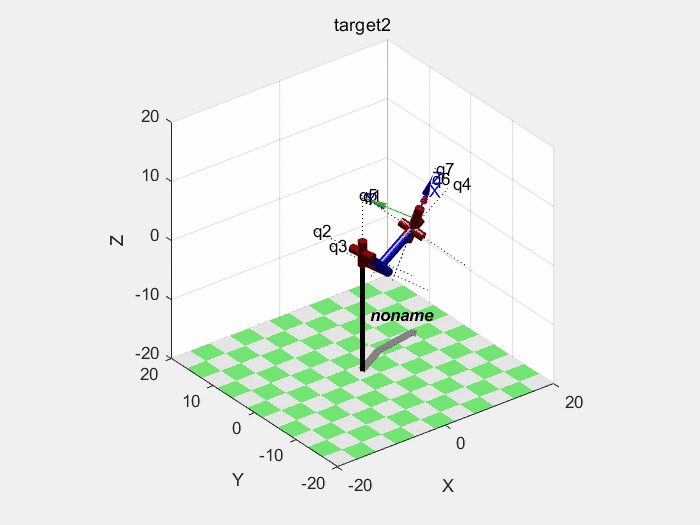

# My final Project for Robotics II : Manipulator

Package requirement: Matlab Robotics Toolbox

**Giving a fixed point, a initial pose and a target pose with a limited time, planning for each joint safely and smoothly.**

Keys: Analytic solution for inverse kinematics with Piper & Cartesian Planning & quadratic-linear interpolation

