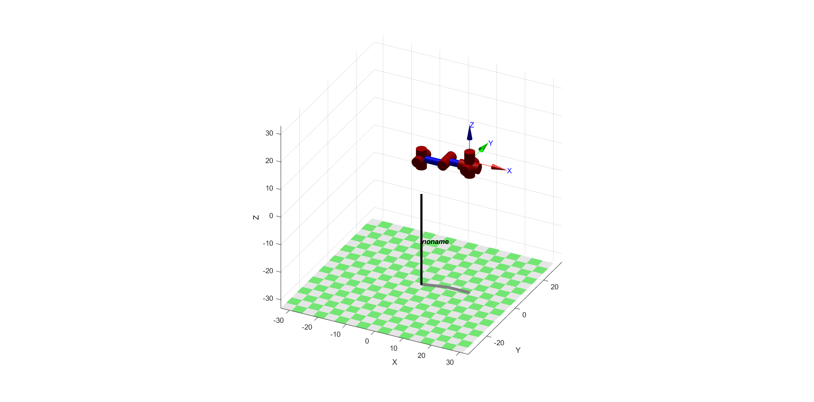
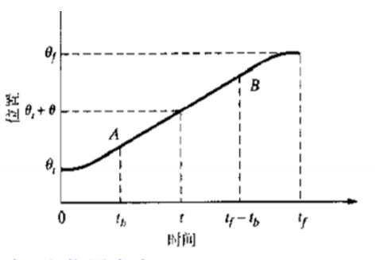
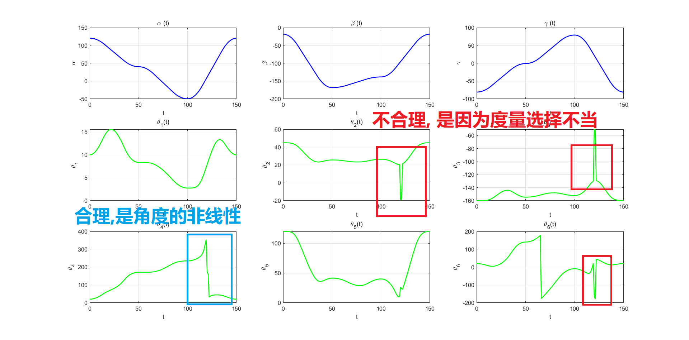
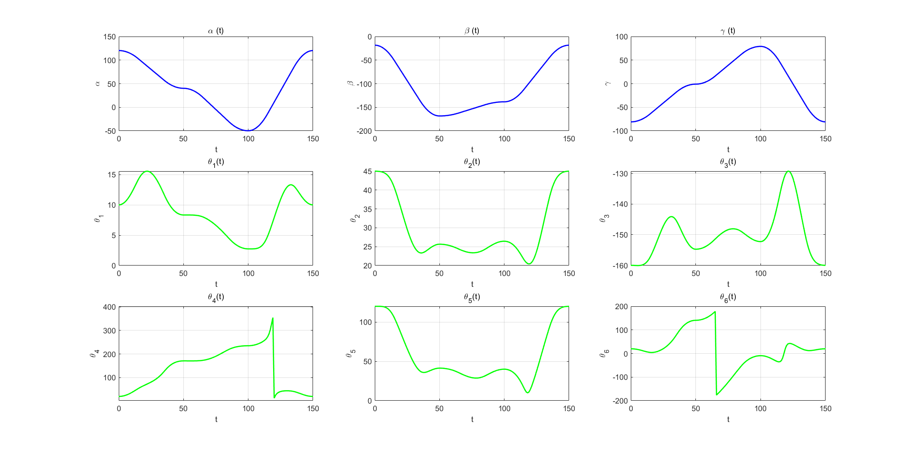
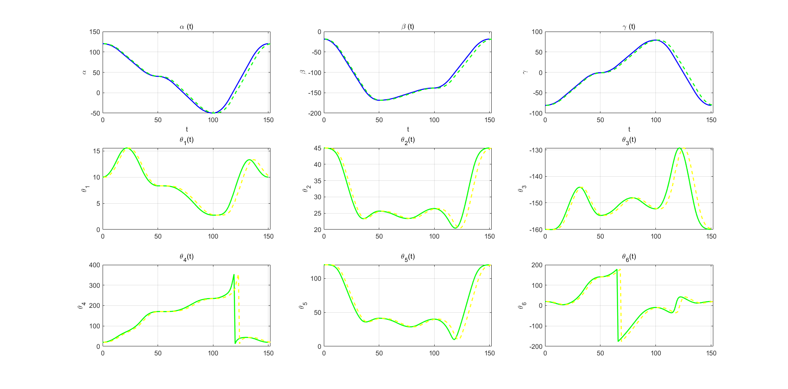
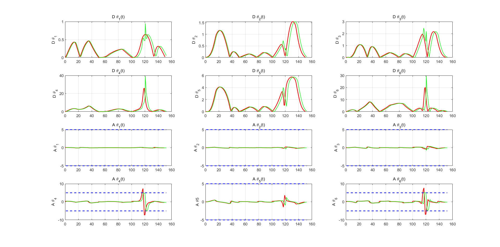
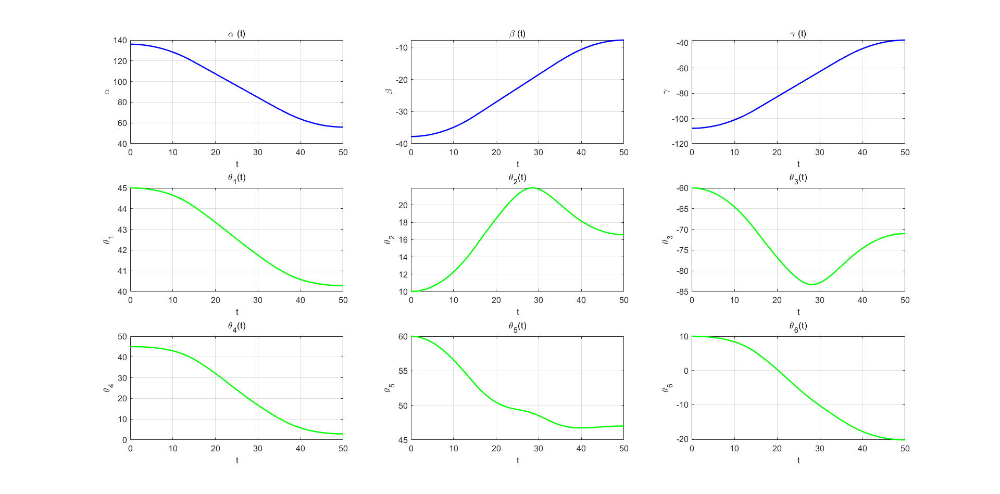
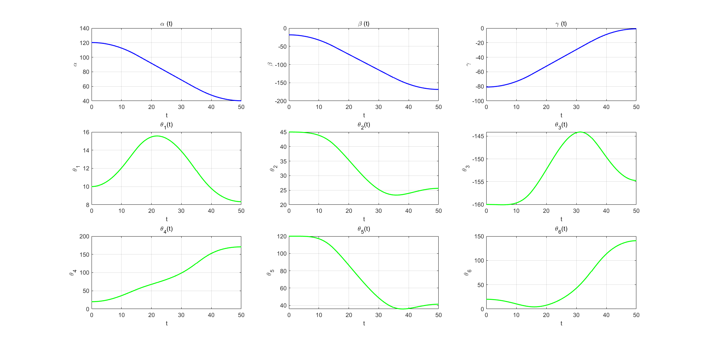

# Final 机械臂规划


[TOC]

## 1. 问题分析

### 1.1 问题阐释

如下图所示操作臂，请规划机械臂各关节的轨迹，使其末端定点转动，即机械臂末端
位置不变，姿态变化，并利用matlab robotics toolbox 进行验证和演示。


### 1.2 问题解决思路的粗浅分析

要的到机械臂的规划, 就必须先得到机械臂的运动模型, 那必须先对机械臂进行DH参数设定, 然后建立坐标系. 

当得到了运动学模型后, 需要对机械臂的末端位姿和关节变量进行规划. 一般规划方法有关节空间规划和笛卡尔空间规划两大类. 

> 1. 关节空间规划的优点在于可以关节变量的变化时连续自然可控的, 但是只能保证在起点和终点末端的期望位姿, 相邻关节点间的位姿不能保证,**所以对于顶点转动末端这个任务, 这显然不是好方法.**
> 2. 笛卡尔空间规划的优点在于可以保证末端位姿连续的根据预期的指定方式变化, 但是要求解逆运动学,且有不可达的中间点, 由于奇异性的存在会出现关节变量的急剧变化,并且虽然理论上中间的过程可达, 但是不一定连续可达. **所以虽然规划出了末端的时间解析表达式, 逆运动学求解后的结果可能也会在实际中出现问题, 但是这个方法更适合我们这次的作业任务**

这次作业, **我采用笛卡尔空间规划法求解** 


## 2. 算法设计与求解

### 2.1 改进DH参数设定和建系

**这一步的操作是要按改进DH参数描述机械臂**


如上图, 选取DH参数和坐标系为:

取$l=2,d=2$  **先不考虑$13$ 另其为0, 好分析**

| 关节编号$i$ | $\alpha_{i-1}$ | $a_{i-1}$ | $d_i$      | $\theta_i$ |
| ----------- | -------------- | --------- | ---------- | ---------- |
| 1           | $0$            | $0$       | $ 13\to 0$ | $\theta_1$ |
| 2           | $-90$          | $0$       | $0$        | $\theta_2$ |
| 3           | $0$            | $8$       | $l=2$      | $\theta_3$ |
| 4           | $-90$          | $0$       | $8$        | $\theta_4$ |
| 5           | $90$           | $0$       | $0$        | $\theta_5$ |
| 6           | $90$           | $0$       | $0$        | $\theta_6$ |
| 7           | $0$            | $0$       | $d=2$      | $0$        |

实际求解的时候, 我设置的参数和关节变量的范围如下表

|     量     |   值/范围    |
| :--------: | :----------: |
| $\theta_1$  |  $(-90,90]$  |
| $\theta_2$  |  $(-45,45]$  |
| $\theta_3$ |  $(-170,-10]$  |
|   $\theta_4$   | $[-180,180)$ |
| $\theta_5$ |      $ [0,180)$      |
| $\theta_6$ |     $[-180,180)$     |

这时候用Robot toolbox查看查看建模是否正确,机械臂一个自然的初始值是 $(0,0,-90,0,90,0)$ 它可视出来如下:



发现坐标系建立正确, 参数设置合理, 可视化的代码见附录`overview.m` 

---

### 2.2 正运动学建模

**这一步的操作是想要用关节变量表示末端坐标系的位姿**

用齐次变换表示连杆联体坐标变换:
$$
_i^{i-1}T=\left(
\matrix{
    \cos\theta_i&-\sin\theta_i&0&a_{i-1}\\
    \sin\theta_i\cos\alpha_{i-1}&\cos\theta_i\cos\alpha_{i-1}& -\sin\alpha_{i-1}&-\sin\alpha_{i-1}d_i\\ 
    \sin\theta_i\sin\alpha_{i-1}&\cos\theta_i\sin\alpha_{i-1}& \cos\alpha_{i-1}&\cos\alpha_{i-1}d_i\\
    0&0&0&1
}
\right)
$$
右乘联体, 所以我们链式的得到末端坐标系在世界坐标系(基座{0}坐标系)下的位姿
$$
^0_NT=^0_1T \times^1_2T\times\cdots\times^{N-1}_NT
$$
用一段MatLab程序自动计算齐次变换并链式传递得到末端坐标系在世界坐标系下的齐次变换, 代码见附录A, 得到结果:
$$
^0_7T=\left(
\matrix{
   r_{11}&r_{12}&r_{13}&p_x\\
   r_{21}&r_{22}&r_{23}&p_y\\
   r_{31}&r_{32}&r_{33}&p_z\\
   0&0&0&1
}
\right)
$$
其中:
$$
\left\{\begin{split}
r_{11}&=- s_6(s_4(c_1s_2s_3 - c_1c_2c_3) + c_4s_1) - c_6(c_5(c_4(c_1s_2s_3 - c_1c_2c_3) - s_1s_4) + s_5(c_1c_2s_3 + c_1c_3s_2))\\
r_{12}&= s_6(c_5(c_4(c_1s_2s_3 - c_1c_2c_3) - s_1s_4) + s_5(c_1c_2s_3 + c_1c_3s_2)) - c_6(s_4(c_1s_2s_3 - c_1c_2c_3) + c_4s_1)\\
r_{13}&=2c_5(c_1c_2s_3 + c_1c_3s_2) - 2s_5(c_4(c_1s_2s_3 - c_1c_2c_3) - s_1s_4) - 2s_1 + 8c_1c_2 - 8c_1c_2s_3 - 8c_1c_3s_2\\
r_{21}&= s_6(c_1c_4 + s_4(c_2c_3s_1 - s_1s_2s_3)) + c_6(c_5(c_4(c_2c_3s_1 - s_1s_2s_3) - c_1s_4) - s_5(c_2s_1s_3 + c_3s_1s_2))\\
r_{22}&=c_6(c_1c_4 + s_4(c_2c_3s_1 - s_1s_2s_3)) - s_6(c_5(c_4(c_2c_3s_1 - s_1s_2s_3) - c_1s_4) - s_5(c_2s_1s_3 + c_3s_1s_2))\\
r_{23}&= s_5(c_4(c_2c_3s_1 - s_1s_2s_3) - c_1s_4) + c_5(c_2s_1s_3 + c_3s_1s_2)\\
r_{31}&=- c_6(s_5(c_2c_3 - s_2s_3) + c_4c_5(c_2s_3 + c_3s_2)) - s_4s_6(c_2s_3 + c_3s_2)\\ 
r_{32}&=s_6(s_5(c_2c_3 - s_2s_3) + c_4c_5(c_2s_3 + c_3s_2)) - c_6s_4(c_2s_3 + c_3s_2)\\ 
r_{33}&=c_5(c_2c_3 - s_2s_3) - c_4s_5(c_2s_3 + c_3s_2)\\
p_x&=c_5(c_1c_2s_3 + c_1c_3s_2) - s_5(c_4(c_1s_2s_3 - c_1c_2c_3) - s_1s_4)\\
p_y&= 2c_1 + 2s_5(c_4(c_2c_3s_1 - s_1s_2s_3) - c_1s_4) + 2c_5(c_2s_1s_3 + c_3s_1s_2) + 8c_2s_1 - 8c_2s_1s_3 - 8c_3s_1s_2\\
p_z&=2c_5(c_2c_3 - s_2s_3) - 8s_2 - 8c_2c_3 + 8s_2s_3 - 2c_4s_5(c_2s_3 + c_3s_2)
\end{split}\right.
$$
这部分是通过Matlab的符号计算获得的, 代码见附录的`Trans()` 和`Forward.m`

将这个齐次变换中的旋转变换表示为**ZY'Z'欧拉角**表示是
$$
\left\{\begin{split}
\beta&=\text{Atan2}(\sqrt{r_{31}^2+r_{32}^2},r_{33},)\\
\alpha&=\text{Atan2}(r_{23}/\sin\beta,r_{13}/\sin\beta)\\
\gamma&=\text{Atan2}(r_{32}/\sin\beta,r_{31}/\sin\beta)
\end{split}\right.
$$
这个欧拉角度表示的变换过程是:

1. 绕Z轴转$\alpha$角
2. 在绕已经改动的Y轴转$\beta$角
3. 最后绕当前Z转$\gamma$角

**注意!**当$\cos(\beta)$一旦是0的时候, 解就退化了, 这时候要特殊处理:
$$
\left\{\begin{split}
\beta&=0\\
\alpha&=0\\
\gamma&=\text{Atan2}(-r_{12},r_{11})
\end{split}\right.
$$
和:
$$
\left\{\begin{split}
\beta&=180\\
\alpha&=0\\
\gamma&=\text{Atan2}(r_{12},-r_{11})
\end{split}\right.
$$
如果已知表示$(\alpha,\beta,\gamma)$ , 可以得到目标的旋转矩阵:
$$
R=\left(
\matrix{
   c_{\alpha}s_{\beta}c_{\gamma}-s_{\alpha}s_{\gamma}
   &-c_{\alpha}c_{\beta}s_{\gamma}-s_{\alpha}c_{\gamma}
   & c_{\alpha}s_{\beta}\\
   s_{\alpha}c_{\beta}c_{\gamma}+c_{\alpha}s_{\gamma}
   &-s_{\alpha}c_{\beta}s_{\gamma}+c_{\alpha}c_{\gamma}
   & s_{\alpha}s_{\beta}\\
   -s_{\beta}c_{\gamma}&s_{\beta}s_{\gamma}&c_{\beta}
   }
\right)
$$

这部分的转化我直接封装了`matlab robotics system toolbox` 的相关函数, 见附录`Eular2R()` 和`R2Eular()` 

同时, 根据正运动学, 建立从关节空间到笛卡尔姿态空间的映射, 函数见附录`Joint2pose()`

---

### 2.4 逆运动学建模

**这一步的目标是找到输入是期望位姿, 输出是关节变量的映射** 

现在我假设最后末端坐标系的位置$P_{7org}$ 和他的旋转$^0_7R$ 已知, 这就是最后要求的机械臂末端位姿. 下面求解4个关节变量.

#### 2.4.1 大臂的Pieper求解

**整个机械臂可分为大臂关节{0}-{3}和手{4}-{6}两部分**

这里先假设知道机械臂关节{4}末端的位置$P_{ORG4}$ **依次向前迭代回去上**

考虑:
$$
\left(\matrix{P_{4ORG}\\1}\right)=^0_1T^1_2T^2_3T\left(\matrix{^3_4P_{4ORG}\\1}\right)
$$
其中:
$$
\left(\matrix{^2P_{4ORG}\\1}\right)=^2_3T\left(\matrix{^3_4P_{4ORG}\\1}\right)=\left(\matrix{
c_3& -s_3& 0& 8\\
s_3& c_3& 0& 0\\
0&0&1&2\\
0&0&0&1
}\right)\left(\matrix{0\\8\\0\\1}\right)=
\left(\matrix{f_1(\theta_3)\\f_2(\theta_3)\\f_3(\theta_3)\\1}\right)
$$
这里有:
$$
\left\{\begin{split}
f_1&=-8s_3+8\\
f_2&=8c_3\\
f_3&=2
\end{split}\right.
$$
再考虑:
$$
\left(\matrix{^1P_{4ORG}\\1}\right)=^1_2T\left(\matrix{^2_4P_{4ORG}\\1}\right)=\left(\matrix{
c_2& -s_2& 0& 0\\
0& 0& 1& 0\\
-s_2&-c_2&0&0\\
0&0&0&1
}\right)
\left(\matrix{f_1(\theta_3)\\f_2(\theta_3)\\f_3(\theta_3)\\1}\right)
=
\left(\matrix{g_1(\theta_2,\theta_3)\\g_2(\theta_2,\theta_3)\\g_3(\theta_2,\theta_3)\\1}\right)
$$
这里有:
$$
\left\{\begin{split}
g_1&=c_2f_1-s_2f_2\\
g_2&=f_3\\
g_3&=-s_2f_1-c_2f_2
\end{split}\right.
$$
最后考虑:
$$
\left(\matrix{x\\y\\z\\1}\right)=^0_1T\left(\matrix{^1_4P_{4ORG}\\1}\right)=\left(\matrix{
c_1&-s_1&0&0\\
s_1&c_1&0&0\\
0&0&1&0\\
0&0&0&1
}\right)
\left(\matrix{g_1\\g_2\\g_3\\1}\right)
=
\left(\matrix{c_1g_1-s_1g_2\\s_1g_2+c_1g_2\\g_3\\1}\right)
$$
令:
$$
r=x^2+y^2+z^2=g_1^2+g_2^2+g_3^2=f_1^2+f_2^2+f_3^2
$$
得到了只和$\theta_3$有关的方程, 求$\theta_3$, 令$u_3=\tan\frac{\theta_3}{2}$ :
$$
r^2=64\biggr(1-\frac{2u_3}{1+u_3^2}\biggr)^2+64\biggr(\frac{1-u_3^2}{1+u_3^2}\biggr)^2+4
$$
$$
0=(132-r^2)u_3^4-256u_3^3+(264-2r^2)u_3^2-256u_3+(132-r^2)
$$

实际上可以化简为二次方程:
$$
(132-r^2)u_3^2-256u_3+(132-r^2)=0
$$
得到一个1元2次方程, 可以求解 $\theta_3$ ,

接下来由于:
$$
z=g_3=-s_2f_1-c_2f_2
$$
由$\theta_3$已知, 可以直接求得 $\theta_2$  ,具体的是用万能公式带入解:
$$
(f_2-z)u_2^2-2f_1u_2+(f_2+z)=0
$$
其中:
$$
u_2=\tan\frac{\theta_2}{2}
$$
最后可以根据:
$$
\left(\matrix{x\\y}\right)
=
\left(\matrix{c_1g_1-s_1g_2\\s_1g_2+c_1g_2}\right)
$$
求$\theta_1$ 是先用一个解出一个解后带入第二个验证, 方法与上面类似, 用万能公式解一个二次方程, 解第一个方程, 
$$
(g_1+x)u_1^2+2g_2u_1+(x-g_1)=0
$$
其中:
$$
u_1=\tan\frac{\theta_1}{2}
$$
最后还要验证y的方程.

这里需要注意$P_{4ORG}$的求解, 已知末端$O$的位置$(p_x,p_y,p_z)^T$, $P_{4ORG}=(x,y,z)^T$ 的位置只和期望的位姿$\alpha,\beta,\gamma$ 有关.
$$
^0_6R\left(\matrix{0\\0\\2}\right)=\left(\matrix{p_x\\p_y\\p_z}\right)-\left(\matrix{x\\y\\z}\right)
$$

#### 2.4.2 机械手的求解

当已经知道了前三个关节的$\theta_1,\theta_2,\theta_3$ 可以	计算, 又第七个关节和第六个关节间无旋转, 只是一个平移关系, 故$^0_7R=^0_6R$是已知的:
$$
^0_4R\biggr|_{\theta_4=0}=^0_3R^3_4R\biggr|_{\theta_4=0}
$$
又已知$^0_7R=^0_6R$:

所以:
$$
^4_6R\biggr|_{\theta_4=0}=^0_4R^{-1}\biggr|_{\theta_4=0}{^0_6R}
$$
又由于末端的$^4_6R\biggr|_{\theta_4=0}$ 正好是一个ZY'Z'欧拉角, 所以可以由2.2所述的转换公式直接得到关节角:
$$
\begin{split}
\theta_4&=180+\alpha'\\
\theta_5&=180+\beta'\\
\theta_6&=\gamma'
\end{split}
$$

**具体在实现中, 我会根据解析解得到所有的解, 同时根据关节角限制筛选合理的解, 最后函数返回前还会通过正运动学验证解是否有偏差, 偏差大的也会筛掉** 具体见附录代码`InvK()`

---

### 2.5 笛卡尔空间规划

**这一步的目标是先在笛卡尔空间规划末端的运动, 再解出关节变量的时间函数**

根据题意, 设定机械末端的位置不变, 给定起始和终止末端姿态, 需要规划处机械臂各个关节的轨迹. 笛卡尔空间规划需要先给出末端运动参数的解析表达式, 然后再设法运用逆运动学求解中途的每个点

#### 2.5.1 末端位姿随时间变化的函数

用**ZY'Z'**欧拉角$(\alpha,\beta,\gamma)$表示位姿. 给定初始时刻的位姿和终止时刻的位姿, 我们可以对每个角度分别进行规划, 原理都是一样的. 这里我采用**带抛物线的线性插补**完成



原理非常简单,如果我们要规划变量$\theta$的时间函数,假设$0$时刻的初始值为$\theta_i$, 在终止时间$t_f$的目标值是$\theta_f$,要初始和末端的速度为0, 本质上只需要解得二次函数的加速度$a$和加速时间$t_b$的关系即可得到解析的规划.

这条曲线关于中点对称, 显然:
$$
a t_b (\frac{t_f}{2}-t_b)+ \frac12 at_b^2=\frac{\theta_f-\theta_i}{2}
$$
所以:
$$
a=\frac{\theta_f-\theta_i}{t_b(t_f-t_b)}
$$
这要求$t_b<\frac{t_f}{2}$ 且实际中加速度也不能超过限制.

这样只要确定一个加速度或者确定一个加速时间,就可以得到一个确定的解析表达式描述目标变量的规划:
$$
\theta(t)=\left\{\begin{split}
&\theta_i+\frac12at^2 &, t\in[0,t_b)\\
&\theta_i+at_bt-\frac12at_b^2 &,t\in[t_b,t_f-t_b)\\
&\theta_f-\frac12a(t_f-t)^2 \ \ &,t\in[t_f-t_b,t_f]
\end{split}\right.
$$
**具体的做法很简单, 对笛卡尔空间中的R用欧拉角表示, 分别对3个角分量进行规划, 得到时间的函数** 

相关操作我封装在了函数中, 输入时间序列和起始终点位置, 可以返回规划的序列, 见附录`quli()`

#### 2.5.2 多解的处理和关节规划的生成

根据上面求得的逆运动学解析求解.**求解析解的重要原因之一是逆运动学有多解** 如下情况, 他们有相同的末端位姿, 但是却有2一个逆运动学解


这里我们还可以发现, **但凡有多解的最多只有2个解** :

因为当末端的位置姿态都限定死了,那么{4}的原点位置就定死了, 剩下3个自由度, 并且有两个关节的转轴是**平行**的, 所以只有平面上的两个不同解.

**对于多解问题, 我在程序设计中选择在关节空间中距离上次最近的解作为当前的规划** 这个距离**不能**是简单的关节**空间的欧式距离!** 

下面的例子是一个失败的规划:



这是我之前简单的用前后两次关节变量的欧式距离得到的解, 可以发现很多奇异的条边, 后来我发现, **这是因为角度空间不是线性的, 超过360度会溢出** 所以用下面的公式计算当前的2个解和前一次的解的距离, 择优选择:
$$
d=(d_1,\cdots d_6)^T
$$

$$
d_i=\min\{|\theta_1^{(i)}-\theta_2^{(i)}|,|\theta_1^{(i)}-\theta_2^{(i)}+360|,|\theta_1^{(i)}-\theta_2^{(i)}-360|\}
$$

其中$\theta_1,\theta_2$是关节空间的两个点, 上标代表第$i$个关节的变量
$$
D=d^Td
$$
得到一个衡量两次解相似度的度量. 它被写成函数`delta_theta()`见附录, 正确的解应该如下:



#### 2.5.3 加速度的修正

当我们的机械臂关节输出的加速度有限时, 需要对加速度进行限幅, 对一组我已经规划好的解, 所有的带帧都是等间隔, 根据解析表达式得到末端位姿然后通过逆运动学得到的, 现在对我们已经规划出的前后相邻点
$$
a=\frac{(x_{i+1}-x_{i})-(x_i-x_{i-1})}{\Delta t^2}
$$
如果有最大加速度限制:
$$
\biggr|\frac{(x_{i+1}-x_{i})-(x_i-x_{i-1})}{\Delta t^2}\biggr| \leq A_{max}
$$
那么我们可以计算一个critical的时间间隔:
$$
\delta t =\sqrt{\max \biggr|\frac{(x_{i+1}-x_{i})-(x_i-x_{i-1})}{ A_{max}}\biggr|}
$$
我们根据这个critical的时间, 把critical时间间隔超过我们等间隔采样时间$dt$的时间段拉长, 但要保证总时间不变, 需要把邻域内critical 时间小于等间隔采样时间的时间段缩短, 直观上讲, **是对时间轴进行微小的伸缩** 

得到修正结果为:





**绿线为修正加速度对时间轴进行拉伸后的规划曲线, 可见超过阈值的加速度都被压回了限制内, 具体代码见附件的`main3.m`** 

---

## 3. 仿真结果分析

MatLab工具箱的下载网址是: http://petercorke.com/wordpress/toolboxes/robotics-toolbox

附录里`main.m` 是我机械臂规划的主函数, 设定初始末端姿态, 可以总动求解然后可视化

#### Eg1 

计算的初始值和目标值

```matlab
Current state [alpha,beta,gamma,x,y,z]:  
135.9920  -37.7679 -107.8198    9.3711   10.4675   -4.9505

Target  state [alpha,beta,gamma,x,y,z]:  
115.9920  -57.7679 -127.8198    9.3711   10.4675   -4.9505
```

可视化关节:


规划的结果曲线是:



运行程序后还可以看到动画.

#### Eg2

计算的初始值和目标值

```matlab
Current state [alpha,beta,gamma,x,y,z]:  
120.2423  -18.4029  -80.9241   12.6819    3.6655   -0.3782

Target  state [alpha,beta,gamma,x,y,z]:   
40.2423 -168.4029   -0.9241   12.6819    3.6655   -0.3782

```

可视化关节:


规划的结果曲线是:



运行程序后还可以看到动画.

#### Eg3 回环

这一步是要规划一个回环, 中间可能多次遇到转角超过360度的情况. 规划的很成功

回路的起点和两个中间点为:

```matlab
Current state [alpha,beta,gamma,x,y,z]:  
120.2423  -18.4029  -80.9241   12.6819    3.6655   -0.3782

Target  state [alpha,beta,gamma,x,y,z]:   
40.2423 -168.4029   -0.9241   12.6819    3.6655   -0.3782

Target2  state [alpha,beta,gamma,x,y,z]:  
-49.7577 -138.4029   79.0759   12.6819    3.6655   -0.3782

```

可视化为:


规划结果为:


**图中的跳变都是合理的, 因为是由于角度的非线性引起的** 

## 附录

#### `overview.m` 

```matlab
%% Overview of our manipulator
clear
load lim.mat

L1=RevoluteMDH('alpha',0,    'a',0,'d',13,'qlim',lim1);
L2=RevoluteMDH('alpha',-pi/2,'a',0,'d',0,'qlim',lim2);
L3=RevoluteMDH('alpha',0,    'a',8,'d',2,'qlim',lim3);
L4=RevoluteMDH('alpha',-pi/2,'a',0,'d',8,'qlim',lim4);
L5=RevoluteMDH('alpha',pi/2  ,'a',0,'d',0,'qlim',lim5);
L6=RevoluteMDH('alpha',pi/2,  'a',0,'d',0,'qlim',lim6);
L7=RevoluteMDH('alpha',0,     'a',0,'d',2,'qlim',[0,0]);

robot=SerialLink([L1,L2,L3,L4,L5,L6,L7]);
robot.display();
theta=[0,0,-pi/2,0,pi/2,0];
theta=[theta,0];
robot.plot(theta)%,'jointdiam',1,'arrow','jaxes','wrist'); 
```

####  `Trans()` 

```matlab
function [T] = Trans(alpha,a,d,theta)
%UNTITLED2 输入参数(数值变量或符号变量)
%  DH参数表: alpha, a, d, theta
%  返回 相邻坐标系的正向其次变换
T=[cosd(theta),-sind(theta),0,a;
    sind(theta)*cosd(alpha), cosd(theta)*cosd(alpha),-sind(alpha),-sind(alpha)*d;
    sind(theta)*sind(alpha),cosd(theta)*sind(alpha),cosd(alpha),cosd(alpha)*d;
    0,0,0,1];
end
```

#### `Forwrad.m`

```matlab
%% Initialize
clear;
syms t1 t2 t3 t4 t5 t6 % Joint Var

%% Get Trans MTX
joint_number = 7;
% Get adjecent Transfer mtx
T01=Trans(0,0,0,t1);
T12=Trans(-90,0,0,t2);
T23=Trans(-0,8,2,t3);
T34=Trans(-90,0,8,t4);
T45=Trans(90,0,0,t5);
T56=Trans(90,0,0,t6);
T67=Trans(0,0,2,0);
T_adj={T01,T12,T23,T34,T45,T56,T67};
%% Forward
T=[];
temp=eye(4);
for i = 1:joint_number
    temp = temp*T_adj{i};
    T{i}=temp;
end
clear temp;
save T.mat T
```

#### `R2Eular()` 

```matlab
function [alpha,beta,gamma] = R2Eular(R)
% Cvt R to ZYZ Eular angle
p=rotm2eul(R,'ZYZ')*180/pi;
alpha=p(1);
beta=p(2);
gamma=p(3);
end
```

#### `Eular2R()`

```matlab
function [R] = Eular2R(alpha,beta,gamma)
% 欧拉角得到旋转矩阵
R=eul2rotm([alpha*pi/180,beta*pi/180,gamma*pi/180],'ZYZ');
end
```

#### `Joint2pose()`

**这里比较繁琐是因为没用符号运算然后赋值的操作, 是为了提高效率**

```matlab
function [pose] = Joint2Pose(tt1,tt2,tt3,tt4,tt5,tt6)
%  用前向传播从关节变量得到Pose (ZY'X')欧拉角表示
% syms t1 t2 t3 t4 t5 t6
% T_val=double(subs(T,[t1,t2,t3,t4,t5,t6],[tt1,tt2,tt3,tt4,tt5,tt6]));
% R=T_val(1:3,1:3);
% [a,b,g]=R2Eular(R);
% pose=[a,b,g,T_val(1:3,4)'];
t1=tt1;t2=tt2;t3=tt3;t4=tt4;t5=tt5;t6=tt6;
r1=[ - sin((pi*t6)/180)*(sin((pi*t4)/180)*(cos((pi*t1)/180)*sin((pi*t2)/180)*sin((pi*t3)/180) - cos((pi*t1)/180)*cos((pi*t2)/180)*cos((pi*t3)/180)) + cos((pi*t4)/180)*sin((pi*t1)/180)) - cos((pi*t6)/180)*(cos((pi*t5)/180)*(cos((pi*t4)/180)*(cos((pi*t1)/180)*sin((pi*t2)/180)*sin((pi*t3)/180) - cos((pi*t1)/180)*cos((pi*t2)/180)*cos((pi*t3)/180)) - sin((pi*t1)/180)*sin((pi*t4)/180)) + sin((pi*t5)/180)*(cos((pi*t1)/180)*cos((pi*t2)/180)*sin((pi*t3)/180) + cos((pi*t1)/180)*cos((pi*t3)/180)*sin((pi*t2)/180))),...
    sin((pi*t6)/180)*(cos((pi*t5)/180)*(cos((pi*t4)/180)*(cos((pi*t1)/180)*sin((pi*t2)/180)*sin((pi*t3)/180) - cos((pi*t1)/180)*cos((pi*t2)/180)*cos((pi*t3)/180)) - sin((pi*t1)/180)*sin((pi*t4)/180)) + sin((pi*t5)/180)*(cos((pi*t1)/180)*cos((pi*t2)/180)*sin((pi*t3)/180) + cos((pi*t1)/180)*cos((pi*t3)/180)*sin((pi*t2)/180))) - cos((pi*t6)/180)*(sin((pi*t4)/180)*(cos((pi*t1)/180)*sin((pi*t2)/180)*sin((pi*t3)/180) - cos((pi*t1)/180)*cos((pi*t2)/180)*cos((pi*t3)/180)) + cos((pi*t4)/180)*sin((pi*t1)/180)),...
    cos((pi*t5)/180)*(cos((pi*t1)/180)*cos((pi*t2)/180)*sin((pi*t3)/180) + cos((pi*t1)/180)*cos((pi*t3)/180)*sin((pi*t2)/180)) - sin((pi*t5)/180)*(cos((pi*t4)/180)*(cos((pi*t1)/180)*sin((pi*t2)/180)*sin((pi*t3)/180) - cos((pi*t1)/180)*cos((pi*t2)/180)*cos((pi*t3)/180)) - sin((pi*t1)/180)*sin((pi*t4)/180)),...
    2*cos((pi*t5)/180)*(cos((pi*t1)/180)*cos((pi*t2)/180)*sin((pi*t3)/180) + cos((pi*t1)/180)*cos((pi*t3)/180)*sin((pi*t2)/180)) - 2*sin((pi*t5)/180)*(cos((pi*t4)/180)*(cos((pi*t1)/180)*sin((pi*t2)/180)*sin((pi*t3)/180) - cos((pi*t1)/180)*cos((pi*t2)/180)*cos((pi*t3)/180)) - sin((pi*t1)/180)*sin((pi*t4)/180)) - 2*sin((pi*t1)/180) + 8*cos((pi*t1)/180)*cos((pi*t2)/180) - 8*cos((pi*t1)/180)*cos((pi*t2)/180)*sin((pi*t3)/180) - 8*cos((pi*t1)/180)*cos((pi*t3)/180)*sin((pi*t2)/180)];
r2=[   sin((pi*t6)/180)*(cos((pi*t1)/180)*cos((pi*t4)/180) + sin((pi*t4)/180)*(cos((pi*t2)/180)*cos((pi*t3)/180)*sin((pi*t1)/180) - sin((pi*t1)/180)*sin((pi*t2)/180)*sin((pi*t3)/180))) + cos((pi*t6)/180)*(cos((pi*t5)/180)*(cos((pi*t4)/180)*(cos((pi*t2)/180)*cos((pi*t3)/180)*sin((pi*t1)/180) - sin((pi*t1)/180)*sin((pi*t2)/180)*sin((pi*t3)/180)) - cos((pi*t1)/180)*sin((pi*t4)/180)) - sin((pi*t5)/180)*(cos((pi*t2)/180)*sin((pi*t1)/180)*sin((pi*t3)/180) + cos((pi*t3)/180)*sin((pi*t1)/180)*sin((pi*t2)/180))),...
    cos((pi*t6)/180)*(cos((pi*t1)/180)*cos((pi*t4)/180) + sin((pi*t4)/180)*(cos((pi*t2)/180)*cos((pi*t3)/180)*sin((pi*t1)/180) - sin((pi*t1)/180)*sin((pi*t2)/180)*sin((pi*t3)/180))) - sin((pi*t6)/180)*(cos((pi*t5)/180)*(cos((pi*t4)/180)*(cos((pi*t2)/180)*cos((pi*t3)/180)*sin((pi*t1)/180) - sin((pi*t1)/180)*sin((pi*t2)/180)*sin((pi*t3)/180)) - cos((pi*t1)/180)*sin((pi*t4)/180)) - sin((pi*t5)/180)*(cos((pi*t2)/180)*sin((pi*t1)/180)*sin((pi*t3)/180) + cos((pi*t3)/180)*sin((pi*t1)/180)*sin((pi*t2)/180))),...
    sin((pi*t5)/180)*(cos((pi*t4)/180)*(cos((pi*t2)/180)*cos((pi*t3)/180)*sin((pi*t1)/180) - sin((pi*t1)/180)*sin((pi*t2)/180)*sin((pi*t3)/180)) - cos((pi*t1)/180)*sin((pi*t4)/180)) + cos((pi*t5)/180)*(cos((pi*t2)/180)*sin((pi*t1)/180)*sin((pi*t3)/180) + cos((pi*t3)/180)*sin((pi*t1)/180)*sin((pi*t2)/180)),...
    2*cos((pi*t1)/180) + 2*sin((pi*t5)/180)*(cos((pi*t4)/180)*(cos((pi*t2)/180)*cos((pi*t3)/180)*sin((pi*t1)/180) - sin((pi*t1)/180)*sin((pi*t2)/180)*sin((pi*t3)/180)) - cos((pi*t1)/180)*sin((pi*t4)/180)) + 2*cos((pi*t5)/180)*(cos((pi*t2)/180)*sin((pi*t1)/180)*sin((pi*t3)/180) + cos((pi*t3)/180)*sin((pi*t1)/180)*sin((pi*t2)/180)) + 8*cos((pi*t2)/180)*sin((pi*t1)/180) - 8*cos((pi*t2)/180)*sin((pi*t1)/180)*sin((pi*t3)/180) - 8*cos((pi*t3)/180)*sin((pi*t1)/180)*sin((pi*t2)/180)];
r3=[ - cos((pi*t6)/180)*(sin((pi*t5)/180)*(cos((pi*t2)/180)*cos((pi*t3)/180) - sin((pi*t2)/180)*sin((pi*t3)/180)) + cos((pi*t4)/180)*cos((pi*t5)/180)*(cos((pi*t2)/180)*sin((pi*t3)/180) + cos((pi*t3)/180)*sin((pi*t2)/180))) - sin((pi*t4)/180)*sin((pi*t6)/180)*(cos((pi*t2)/180)*sin((pi*t3)/180) + cos((pi*t3)/180)*sin((pi*t2)/180)),...
    sin((pi*t6)/180)*(sin((pi*t5)/180)*(cos((pi*t2)/180)*cos((pi*t3)/180) - sin((pi*t2)/180)*sin((pi*t3)/180)) + cos((pi*t4)/180)*cos((pi*t5)/180)*(cos((pi*t2)/180)*sin((pi*t3)/180) + cos((pi*t3)/180)*sin((pi*t2)/180))) - cos((pi*t6)/180)*sin((pi*t4)/180)*(cos((pi*t2)/180)*sin((pi*t3)/180) + cos((pi*t3)/180)*sin((pi*t2)/180)),...
    cos((pi*t5)/180)*(cos((pi*t2)/180)*cos((pi*t3)/180) - sin((pi*t2)/180)*sin((pi*t3)/180)) - cos((pi*t4)/180)*sin((pi*t5)/180)*(cos((pi*t2)/180)*sin((pi*t3)/180) + cos((pi*t3)/180)*sin((pi*t2)/180)), ...
    2*cos((pi*t5)/180)*(cos((pi*t2)/180)*cos((pi*t3)/180) - sin((pi*t2)/180)*sin((pi*t3)/180)) - 8*sin((pi*t2)/180) - 8*cos((pi*t2)/180)*cos((pi*t3)/180) + 8*sin((pi*t2)/180)*sin((pi*t3)/180) - 2*cos((pi*t4)/180)*sin((pi*t5)/180)*(cos((pi*t2)/180)*sin((pi*t3)/180) + cos((pi*t3)/180)*sin((pi*t2)/180))];
R=[r1(1:3);r2(1:3);r3(1:3)];
[a,b,g]=R2Eular(R);
pose=[a,b,g,r1(end),r2(end),r3(end)];
end
```

#### `InvK()`

```matlab
function [P] = InvK(alpha,beta,gamma,x,y,z)
% 逆运动学求解, 输入末端ZY'X'欧拉角
    %% Init and Sovle {4} Porg
    %load lim.mat ;
    lim1=[-90,90];
    lim2=[-45,45];
    lim3=[-135,-45];
    lim4=[-180,180];
    lim5=[0,180];
    lim6=[-180,180];
    param=[];
    pose_true=[alpha,beta,gamma,x,y,z];
    % Get {4}  Porg
    R06=Eular2R(alpha,beta,gamma);
    P4org=[x,y,z]'-R06*[0,0,2]';
   %% Solve Arm
    % Solve theta3 <=4 solutions
    r2=P4org'*P4org;
%     u=roots([2*64-(r2-4),-4*64,4*64-2*(r2-4),-4*64,2*64-(r2-4)])
    t3a=132-r2;t3b=-256; t3c=t3a;
    u=[1/(2*t3a)*(-t3b+sqrt(t3b^2-4*t3a*t3c)),1/(2*t3a)*(-t3b-sqrt(t3b^2-4*t3a*t3c))];   
    theta3=[];
    for idx = 1:2
        tt3=u(idx);
        if abs(imag(tt3))<1e-4
            tt3=real(tt3);
            t3=2*atand(tt3);
            if t3>lim3(1)-0.5 && t3<lim3(2)+0.5
                theta3=[theta3,real(t3)];
            end
        end
    end
    theta3=unique(theta3);
    if isempty(theta3)
        P=[NaN,NaN,NaN,NaN,NaN,NaN];
        return;
    end
    % Solve theta 2
    theta23=[];
    for idx = 1:1:length(theta3)
        % For each theta3
        t3=theta3(idx);
        f1=-8*sind(t3)+8;
        f2=8*cosd(t3);
        f3=2;
        % z=-s_2f_1-c_2f_2
        % z*(1+u^2)=-2*u*f1-(1-u^2)*f2
        % (f2-z)u^2-2*f1*u-(f2+z)=0
        %t2=double(solve(-sind(X)*f1-cosd(X)*f2==P4org(3)));
        %tt2=roots([f2-P4org(3),-2*f1,-(f2+P4org(3))]);
        t2a=f2-P4org(3);t2b=-2*f1; t2c=-(f2+P4org(3));
        tt2=[1/(2*t2a)*(-t2b+sqrt(t2b^2-4*t2a*t2c)),1/(2*t2a)*(-t2b-sqrt(t2b^2-4*t2a*t2c))];
        tt2=real(tt2);
        t2=atand(tt2);
        t2 = t2*2;
        % check t2
        for jdx=1:1:length(t2)
            if t2(jdx)>lim2(1)-0.5 && t2(jdx)<lim2(2)+0.5
                theta23=[theta23;real(t2(jdx)),t3];
            end
        end
    end
    if isempty(theta23)
        P=[NaN,NaN,NaN,NaN,NaN,NaN];
        return;
    end
    % Solve theta1
    theta123=[];
    for idx = 1:1:length(theta23(:,1))
        % For each t2,t3 combination
        t3=theta23(idx,2);
        t2=theta23(idx,1);
        f1=-8*sind(t3)+8;
        f2=8*cosd(t3);
        f3=2;
        g1=cosd(t2)*f1-sind(t2)*f2;
        g2=f3;
        g3=-sind(t2)*f1-cosd(t2)*f2;
        % x=c1g1-s1g2
        % (1+u^2)*x=(1-u^2)*g1-2*u*g2
        % (x+g1)*u^2 + 2*g2*u + (x-g1)
        % t1=double(solve(cosd(X)*g1-sind(X)*g2==P4org(1)));
        tt1=roots([P4org(1)+g1,2*g2,P4org(1)-g1]);
        t1a=P4org(1)+g1;t1b=2*g2;t1c=P4org(1)-g1;
        tt1=[1/(2*t1a)*(-t1b+sqrt(t1b^2-4*t1a*t1c)),1/(2*t1a)*(-t1b-sqrt(t1b^2-4*t1a*t1c))];
        tt1=real(tt1);
        t1=atand(tt1);
        t1=t1*2;
        for jdx=1:1:length(t1)
            if t1(jdx)>lim1(1)-0.5 && t1(jdx)<lim1(2)+0.5
                theta123=[theta123;real(t1(jdx)),t2,t3];
            end
        end
    end
    if isempty(theta123)
        P=[NaN,NaN,NaN,NaN,NaN,NaN];
        return;
    end
    %%  Solve hand
    clear t1 t2 t3 t4;
    syms t1 t2 t3 t4;
    for idx = 1:1:length(theta123(:,1))
        % Get R04|t4=0
        %T_valed=double(subs(T{4},[t1,t2,t3,t4],[theta123(idx,1),theta123(idx,2),theta123(idx,3),0]));
        T_valued=T4forward(theta123(idx,1),theta123(idx,2),theta123(idx,3),0);
        R_valued=T_valued(1:3,1:3);
        R46=R_valued'*R06;
        [aa,bb,gg]=R2Eular(R46);
        tt4=180+aa;
        tt5=180+bb;
        tt6=gg;
        % Check 
       if tt5>lim5(1)-0.5 && tt5<lim5(2)+0.5
           param=[param;[theta123(idx,:),tt4,tt5,tt6]]; 
       end
    end
    
    %% Choose correct 
    P=[];
    if isempty(param)
        P=[NaN,NaN,NaN,NaN,NaN,NaN];
        return;
    end
    for idx = 1:1:length(param(:,1))
        pose = Joint2Pose(param(idx,1),param(idx,2),param(idx,3),param(idx,4),param(idx,5),param(idx,6));
        error=sqrt((pose-pose_true)*(pose-pose_true)');
        if error<1e-4
            P=[P;param(idx,:)];
        end
    end
    if size(P)==0
        P=[NaN,NaN,NaN,NaN,NaN,NaN];
    end
return;
end
```

#### `quli()`

```matlab
function [xt] =quli(t,rtb,xi,xf)
%  二次线性插补
%  t是时间切片, 末端时间就是tf , 返回的xt是时间序列, rtb是tb占总时长tf的比例
%  xi xf 是初始末端目标值
tf=t(end);
tb=tf*rtb;
a=(xf-xi)/(tb*(tf-tb));
T1=t(1:floor(tb/(t(2)-t(1))));
T2=t(floor(tb/(t(2)-t(1)))+1:ceil((tf-tb)/(t(2)-t(1))));
T3=t(ceil((tf-tb)/(t(2)-t(1))):end);
x1=xi+0.5*a.*T1.^2;
x2=xi+a*tb.*T2-0.5*a*tb^2;
x3=xf-0.5*a.*(tf-T3).^2;
xt=[x1,x2,x3];
xt=xt(1:length(t));
end
```

#### `main.m`

main是经过两个预设中间点然后转回原位, main2是普通的规划点到点

```matlab
%% Config
clear
tmax=50;
t=0:1:tmax;
Rtb=0.3;

%% Init
load lim.mat;
load T.mat;
%theta0=[45,10,-60,45,60,10];
theta0=[10,45,-160,20,120,20];
current=Joint2Pose(theta0(1),theta0(2),...
   theta0(3),theta0(4),theta0(5),theta0(6));
% target=...
%     [current(1)-80,...
%     current(2)+90,...
%     current(3)+70,...
%     current(4:6)];
target=...
    [current(1)-80,...
    current(2)-150,...
    current(3)+80,...
    current(4:6)];
target1=...
    [target(1)-90,...
    target(2)+30,...
    target(3)+80,...
    target(4:6)];
fprintf("Current state [alpha,beta,gamma,x,y,z]:");
disp(current);
fprintf("Target  state [alpha,beta,gamma,x,y,z]:");
disp(target);
fprintf("Target2  state [alpha,beta,gamma,x,y,z]:");
disp(target1);

L1=RevoluteMDH('alpha',0,    'a',0,'d',0,'qlim',lim1);
L2=RevoluteMDH('alpha',-pi/2,'a',0,'d',0,'qlim',lim2);
L3=RevoluteMDH('alpha',0,    'a',8,'d',2,'qlim',lim3);
L4=RevoluteMDH('alpha',-pi/2,'a',0,'d',8,'qlim',lim4);
L5=RevoluteMDH('alpha',pi/2  ,'a',0,'d',0,'qlim',lim5);
L6=RevoluteMDH('alpha',pi/2,  'a',0,'d',0,'qlim',lim6);
L7=RevoluteMDH('alpha',0,     'a',0,'d',2,'qlim',[0,0]);
robot=SerialLink([L1,L2,L3,L4,L5,L6,L7]);

figure(1);
theta1=theta0*pi/180;
robot.plot([theta1,0],'jointdiam',1,'arrow','jaxes','wrist');
title("current");
param = InvK(target(1),target(2),...
     target(3),target(4),target(5),target(6));
theta2=param(1,:);
dtheta=delta_theta(theta0,theta2);
for idx = 1:1:length(param(:,1))
    if (param(idx,:)-theta0)*(param(idx,:)-theta0)'<dtheta
        dtheta=(param(idx,:)-theta0)*(param(idx,:)-theta0)';
        theta2=param(idx,:);
    end
end
param = InvK(target1(1),target1(2),...
     target1(3),target1(4),target1(5),target1(6));
theta3=param(1,:);
dtheta=delta_theta(theta0,theta2);
for idx = 1:1:length(param(:,1))
    if (param(idx,:)-theta0)*(param(idx,:)-theta0)'<dtheta
        dtheta=(param(idx,:)-theta0)*(param(idx,:)-theta0)';
        theta3=param(idx,:);
    end
end
pause;
robot.plot([theta2*pi/180,0],'jointdiam',1,'arrow','jaxes','wrist');
title("target");
pause
robot.plot([theta3*pi/180,0],'jointdiam',1,'arrow','jaxes','wrist');
title("target2");
pause
clear theta2 theta1

%% Program

% Plot Catesian Space Planning
figure(2);
alpha1=quli(t,Rtb,current(1),target(1));
alpha2=quli(t,Rtb,target(1),target1(1));
alpha3=quli(t,Rtb,target1(1),current(1));
alpha=[alpha1,alpha2,alpha3];
subplot(3,3,1);
plot([t,t+tmax,t+2*tmax],alpha,'blue','LineWidth',1.5); grid on;
title("\alpha (t)"); xlabel("t"); ylabel("\alpha");
beta1=quli(t,Rtb,current(2),target(2));
beta2=quli(t,Rtb,target(2),target1(2));
beta3=quli(t,Rtb,target1(2),current(2));
beta=[beta1,beta2,beta3];
subplot(3,3,2);
plot([t,t+tmax,t+2*tmax],beta,'blue','LineWidth',1.5); grid on;
title("\beta (t)"); xlabel("t"); ylabel("\beta");
gamma1=quli(t,Rtb,current(3),target(3));
gamma2=quli(t,Rtb,target(3),target1(3));
gamma3=quli(t,Rtb,target1(3),current(3));
gamma=[gamma1,gamma2,gamma3];
subplot(3,3,3);
plot([t,t+tmax,t+2*tmax],gamma,'blue','LineWidth',1.5);grid on;
title("\gamma (t)"); xlabel("t"); ylabel("\gamma");

% Planning of theta
Theta_Planned=theta0;
t=[t,t+tmax,t+2*tmax];
T_planned=[t(1)];
p=current(4:6);
for index = 1:length(t)
    param=InvK(alpha(index),beta(index),gamma(index),p(1),p(2),p(3));
    if isnan(param(1,1))
        continue;
    end
    theta2=param(1,:);
    theta0=Theta_Planned(end,:);
    dtheta=delta_theta(theta0,theta2);
    for idx = 1:1:length(param(:,1))
        if delta_theta(theta0,theta2)<dtheta
            dtheta=(param(idx,:)-theta0)*(param(idx,:)-theta0)';
            theta2=param(idx,:);
        end
    end
    Theta_Planned=[Theta_Planned;theta2];
    T_planned=[T_planned,t(index)];
    fprintf("TimeStampidx: %d Success \n",index);
end

% Plot the results
subplot(3,3,4);
plot(T_planned,Theta_Planned(:,1)','g','LineWidth',1.5); grid on;
title("\theta_1(t)"); xlabel("t"); ylabel("\theta_1");
subplot(3,3,5);
plot(T_planned,Theta_Planned(:,2)','g','LineWidth',1.5); grid on;
title("\theta_2(t)"); xlabel("t"); ylabel("\theta_2");
subplot(3,3,6);
plot(T_planned,Theta_Planned(:,3)','g','LineWidth',1.5); grid on;
title("\theta_3(t)"); xlabel("t"); ylabel("\theta_3");
subplot(3,3,7);
plot(T_planned,Theta_Planned(:,4)','g','LineWidth',1.5); grid on;
title("\theta_4(t)"); xlabel("t"); ylabel("\theta_4");
subplot(3,3,8);
plot(T_planned,Theta_Planned(:,5)','g','LineWidth',1.5); grid on;
title("\theta_5(t)"); xlabel("t"); ylabel("\theta_5");
subplot(3,3,9);
plot(T_planned,Theta_Planned(:,6)','g','LineWidth',1.5); grid on;
title("\theta_6(t)"); xlabel("t"); ylabel("\theta_6");

%% Show

Theta_Planned=[Theta_Planned,zeros([length(Theta_Planned(:,1)),1])];
Theta_Planned=Theta_Planned*pi/180;

figure(1)
plot3(current(4),current(5),current(6),'*','LineWidth',1.5);
hold on;
robot.plot(Theta_Planned,'jointdiam',1,'arrow','jaxes','wrist');
```

#### `main2.m`

```matlab
%% Config
clear
t=0:0.1:50;
Rtb=0.3;

%% Init
load lim.mat;
load T.mat;
%theta0=[45,10,-60,45,60,10];
theta0=[10,45,-160,20,120,20];
current=Joint2Pose(theta0(1),theta0(2),...
   theta0(3),theta0(4),theta0(5),theta0(6));
% target=...
%     [current(1)-80,...
%     current(2)+90,...
%     current(3)+70,...
%     current(4:6)];
target=...
    [current(1)-80,...
    current(2)-150,...
    current(3)+80,...
    current(4:6)];
fprintf("Current state [alpha,beta,gamma,x,y,z]:");
disp(current);
fprintf("Target  state [alpha,beta,gamma,x,y,z]:");
disp(target);

L1=RevoluteMDH('alpha',0,    'a',0,'d',0,'qlim',lim1);
L2=RevoluteMDH('alpha',-pi/2,'a',0,'d',0,'qlim',lim2);
L3=RevoluteMDH('alpha',0,    'a',8,'d',2,'qlim',lim3);
L4=RevoluteMDH('alpha',-pi/2,'a',0,'d',8,'qlim',lim4);
L5=RevoluteMDH('alpha',pi/2  ,'a',0,'d',0,'qlim',lim5);
L6=RevoluteMDH('alpha',pi/2,  'a',0,'d',0,'qlim',lim6);
L7=RevoluteMDH('alpha',0,     'a',0,'d',2,'qlim',[0,0]);
robot=SerialLink([L1,L2,L3,L4,L5,L6,L7]);

figure(1);
theta1=theta0*pi/180;
robot.plot([theta1,0],'jointdiam',1,'arrow','jaxes','wrist');
title("current");
param = InvK(target(1),target(2),...
     target(3),target(4),target(5),target(6));
theta2=param(1,:);
dtheta=(theta2-theta0)*(theta2-theta0)';
for idx = 1:1:length(param(:,1))
    if (param(idx,:)-theta0)*(param(idx,:)-theta0)'<dtheta
        dtheta=(param(idx,:)-theta0)*(param(idx,:)-theta0)';
        theta2=param(idx,:);
    end
end
pause;
robot.plot([theta2*pi/180,0],'jointdiam',1,'arrow','jaxes','wrist');
title("target");
pause
clear theta2 theta1

%% Program

% Plot Catesian Space Planning
figure(2);
alpha=quli(t,Rtb,current(1),target(1));
subplot(3,3,1);
plot(t,alpha,'blue','LineWidth',1.5); grid on;
title("\alpha (t)"); xlabel("t"); ylabel("\alpha");
beta=quli(t,Rtb,current(2),target(2));
subplot(3,3,2);
plot(t,beta,'blue','LineWidth',1.5); grid on;
title("\beta (t)"); xlabel("t"); ylabel("\beta");
gamma=quli(t,Rtb,current(3),target(3));
subplot(3,3,3);
plot(t,gamma,'blue','LineWidth',1.5);grid on;
title("\gamma (t)"); xlabel("t"); ylabel("\gamma");

% Planning of theta
Theta_Planned=theta0;
T_planned=[t(1)];
p=current(4:6);
for index = 1:length(t)
    param=InvK(alpha(index),beta(index),gamma(index),p(1),p(2),p(3));
    if isnan(param(1,1))
        continue;
    end
    theta2=param(1,:);
    theta0=Theta_Planned(end,:);
    dtheta=(theta2-theta0)*(theta2-theta0)';
    for idx = 1:1:length(param(:,1))
        if (param(idx,:)-theta0)*(param(idx,:)-theta0)'<dtheta
            dtheta=(param(idx,:)-theta0)*(param(idx,:)-theta0)';
            theta2=param(idx,:);
        end
    end
    Theta_Planned=[Theta_Planned;theta2];
    T_planned=[T_planned,t(index)];
    fprintf("TimeStampidx: %d Success \n",index);
end

% Plot the results
subplot(3,3,4);
plot(T_planned,Theta_Planned(:,1)','g','LineWidth',1.5); grid on;
title("\theta_1(t)"); xlabel("t"); ylabel("\theta_1");
subplot(3,3,5);
plot(T_planned,Theta_Planned(:,2)','g','LineWidth',1.5); grid on;
title("\theta_2(t)"); xlabel("t"); ylabel("\theta_2");
subplot(3,3,6);
plot(T_planned,Theta_Planned(:,3)','g','LineWidth',1.5); grid on;
title("\theta_3(t)"); xlabel("t"); ylabel("\theta_3");
subplot(3,3,7);
plot(T_planned,Theta_Planned(:,4)','g','LineWidth',1.5); grid on;
title("\theta_4(t)"); xlabel("t"); ylabel("\theta_4");
subplot(3,3,8);
plot(T_planned,Theta_Planned(:,5)','g','LineWidth',1.5); grid on;
title("\theta_5(t)"); xlabel("t"); ylabel("\theta_5");
subplot(3,3,9);
plot(T_planned,Theta_Planned(:,6)','g','LineWidth',1.5); grid on;
title("\theta_6(t)"); xlabel("t"); ylabel("\theta_6");

%% Show

Theta_Planned=[Theta_Planned,zeros([length(Theta_Planned(:,1)),1])];
Theta_Planned=Theta_Planned*pi/180;

figure(1)
plot3(current(4),current(5),current(6),'*','LineWidth',1.5);
robot.plot(Theta_Planned,'jointdiam',1,'arrow','jaxes','wrist');

```

#### `delta_theta()`

```matlab
function [D] = delta_theta(theta1,theta2)
% 度量非线性的旋转角度的距离
d=[];
for idx = 1:length(theta1)
    d(idx)=min([abs(theta1(idx)-theta2(idx)),abs(theta1(idx)-360-theta2(idx))...
        ,abs(theta1(idx)+360-theta2(idx))]);
end
D=sum(d.^2);
end
```


